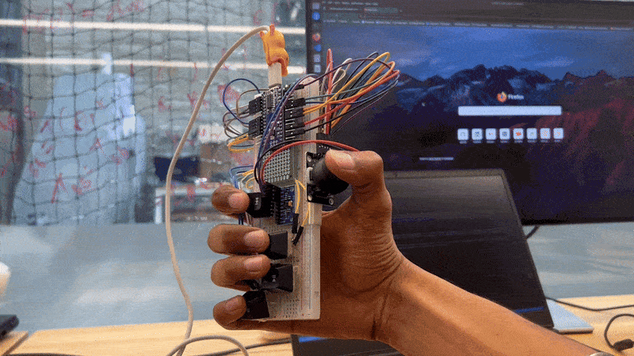

# Knuckles

**Knuckles** is a digital musical instrument that combines a joystick, trigger buttons, and IMU-based orientation data to dynamically control audio tracks and sound effects in Max MSP.
 

---

## Hardware Setup

| Component           | Purpose                                                  |
|--------------------|----------------------------------------------------------|
| Arduino Nano       | Serial communication between Max MSP and sensors         |
| MPU 9250 IMU       | Orientation sensing to switch between performance modes  |
| Analog Joystick    | Volume control and crossfading between audio samples     |
| Mechanical Switches| Triggering audio samples and effects                     |

All sensors are wired to the Arduino Nano, which sends serialized data to Max MSP over USB. The IMU is connected via I2C, and button states are read as digital inputs.

---

## Arduino Code
Code for serial communication can be found in the `Handheld Instrument` directory.<br>
IMU data is processed using the [Madgwick filter](https://x-io.co.uk/open-source-imu-and-ahrs-algorithms/), which converts accelerometer and gyroscope readings into quaternions:

```cpp
 // Update Madgwick Filter
  filter.update(gx, gy, gz, accelData.accelX, accelData.accelY, accelData.accelZ, magData.magX, magData.magY, magData.magZ);

  // Get orientation in quaternions
  float qw = filter.getQuatW();
  float qx = filter.getQuatX();
  float qy = filter.getQuatY();
  float qz = filter.getQuatZ();
```
